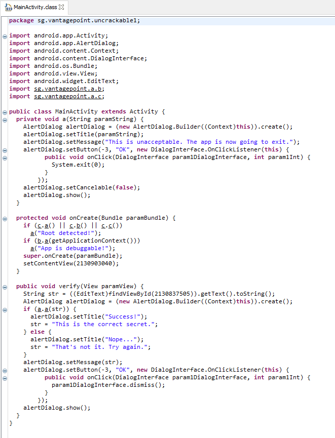
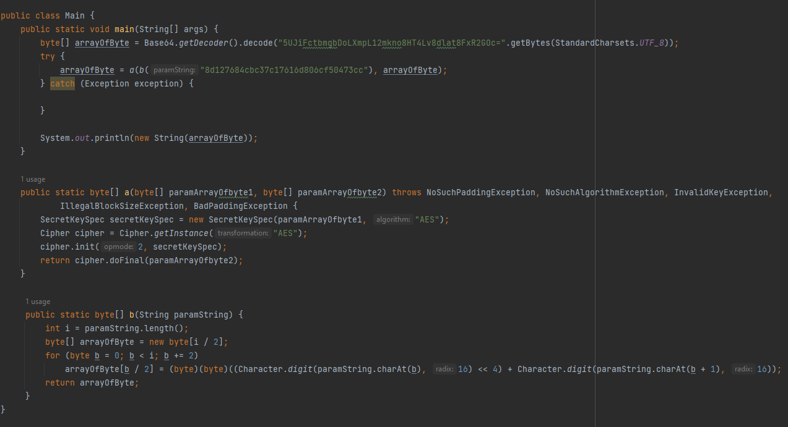
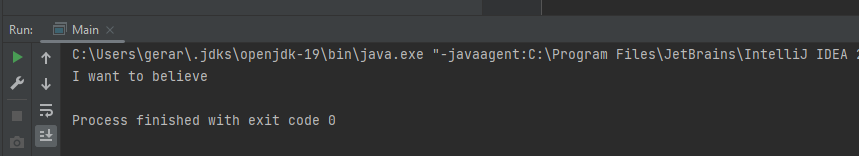

# owasp-uncrackable-lvl-1
By Gerard Bosacki

In this exercise, I was tasked to access application's secret string using source code analysis. Tools I used:

1. Dex2jar converter (<a href="https://github.com/pxb1988/dex2jar">).
2. JD-GUI for analysing source code (<a href="http://java-decompiler.github.io/">)
3. IntelliJ IDEA and Android Studio for executing application's code.

I started with downloading .apk file and unpacking it using WinRAR. Then I extracted classes.dex file from unpacked application file. Using a converter and JD-GUI, I was able to peek into application's source code:

After reviewing it, I was able to conduct that the application uses 2 functions that perform encrypting (<b>a</b> and <b>b</b>) and then merges their results together to obtain a final cipher.
So I figured: all I need to do is perform actions in those functions in a reversed order.
Here is the final version of application source code moved into my local IntelliJ:

On line 16, I call both encrypting functions and print out the secret string. The result is "i want to believe":

It concludes given task for this exercise.
